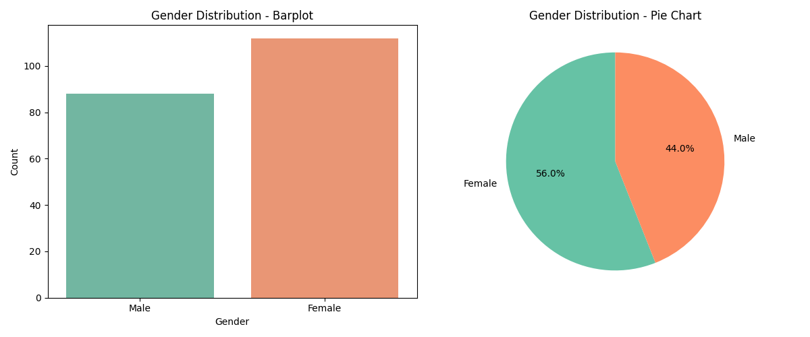
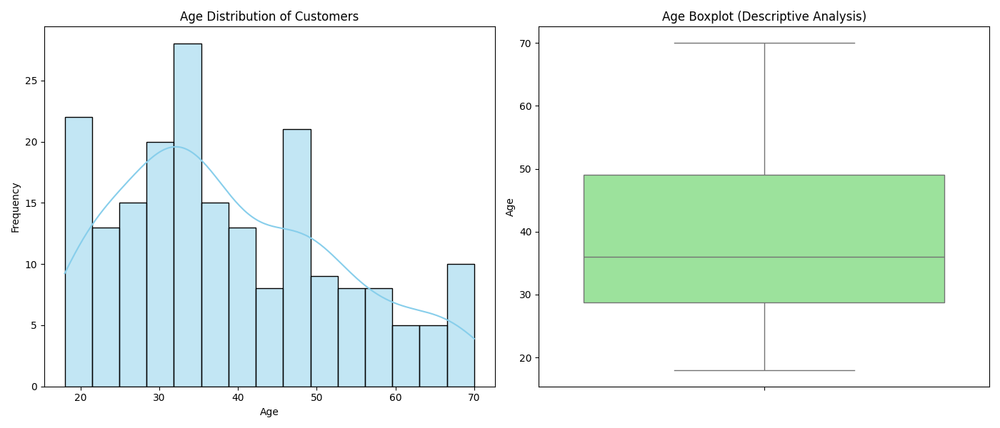
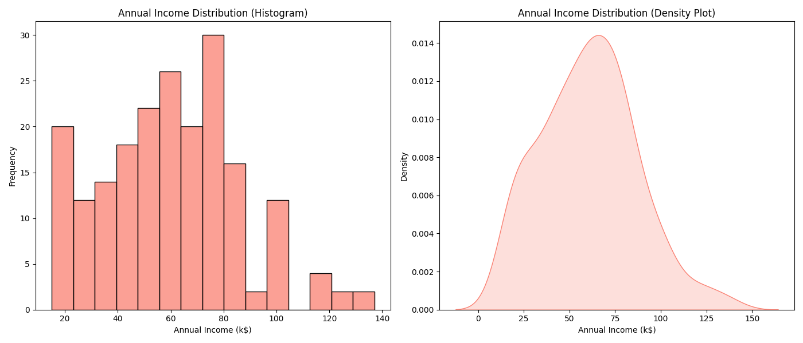
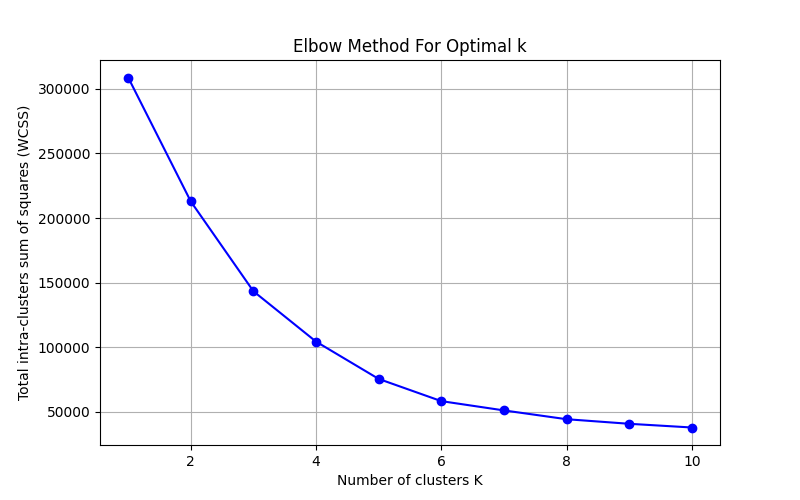
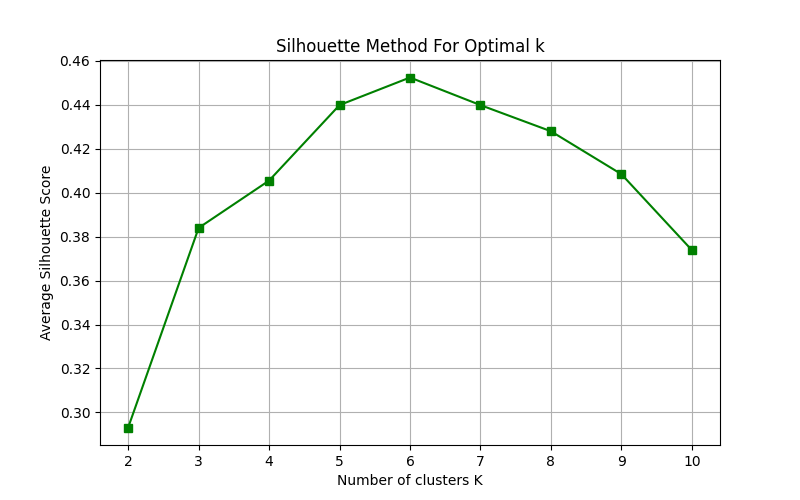
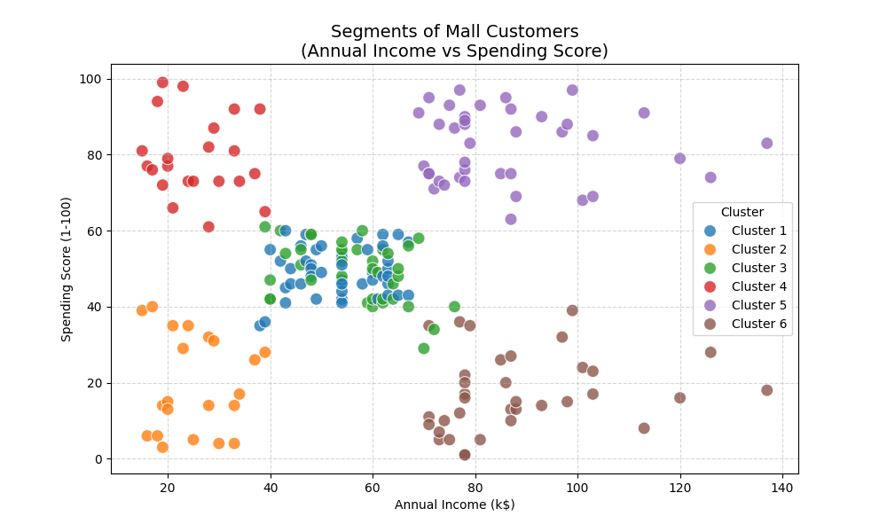
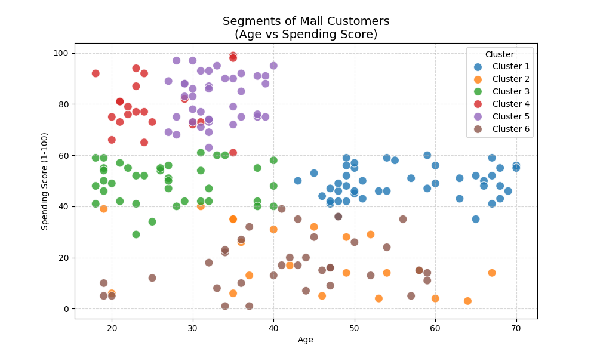
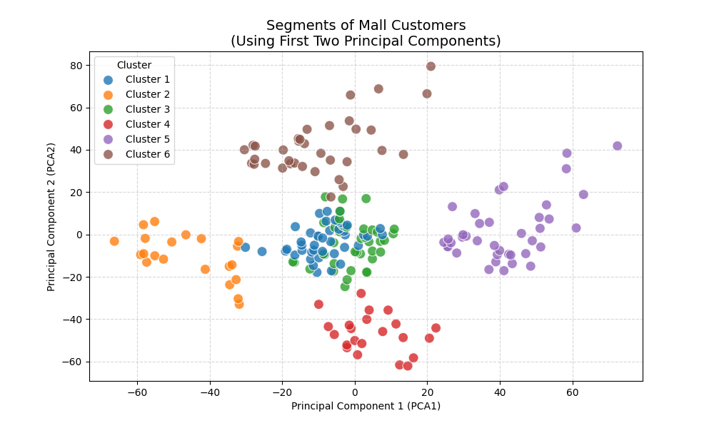
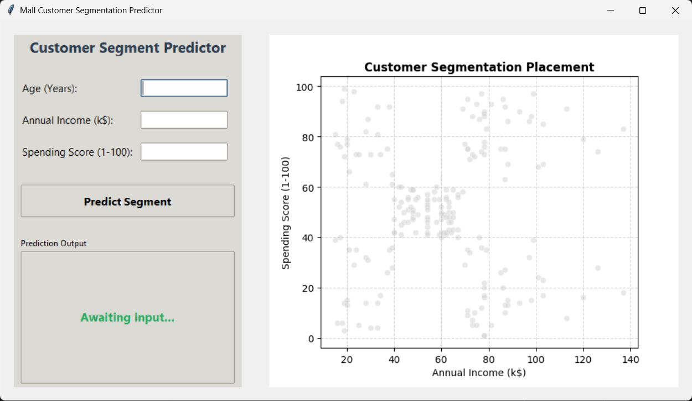

# Mall Customer Segmentation

## Problem Statement
Understanding customer behavior is a pivotal challenge in modern retail. Without knowing who the customers are and how they spend, marketing campaigns become inefficient and generalized. The objective of this project is to analyze a dataset of mall customers and group them into distinct segments based on their age, annual income, and spending score. By identifying these target customer segments, the marketing team can formulate precise, targeted strategies to maximize profit and customer satisfaction.

## Proposed Model
The proposed solution utilizes **K-Means Clustering**, an unsupervised machine learning algorithm. K-Means aims to partition the customers into `k` distinct clusters, where each customer belongs to the cluster with the nearest mean (centroid). By evaluating the multi-dimensional distance between customers (Age, Annual Income, and Spending Score), the algorithm effectively identifies latent patterns and segments customers with similar behavioral metrics without needing pre-labeled data.

---

## 1. Exploratory Data Analysis (EDA) Methodology

Before diving into machine learning, it is crucial to understand the underlying distribution of the data. The EDA phase involves analyzing individual features to grasp the demographics and financial standing of the mall's customer base.

### Gender Distribution
First, we analyze the gender distribution to see if the customer base is skewed. We use a barplot and a pie chart to visualize the count and percentage of Male vs. Female customers.


### Age Distribution
Understanding the age demographic helps in tailoring products. We plot a histogram with a Kernel Density Estimate (KDE) to view the frequency of different age groups, alongside a boxplot to identify quartiles and potential outliers.


### Annual Income Distribution
Finally, we examine the financial strength of the customers using a histogram and density plot for Annual Income. This helps in understanding the purchasing power distribution across the dataset.


---

## 2. Working of the K-Means Model

To configure the K-Means algorithm correctly, we must define the optimal number of clusters (`k`). We utilize two primary mathematical heuristics to find this optimal point:

### The Elbow Method
The Elbow Method calculates the Within-Cluster-Sum-of-Squares (WCSS). As `k` increases, WCSS drops. The optimal `k` is found at the "elbow" of the curve, where adding more clusters yields diminishing returns in variance reduction.


### The Average Silhouette Method
The Silhouette Method measures how similar an object is to its own cluster compared to other clusters. A higher average silhouette score indicates better-defined clusters. Based on our analysis, we determined that **k = 6** is the optimal number of clusters.


---

## 3. Final Customer Segments

With `k=6`, the model segments the dataset into 6 distinct behavioral profiles. We visualize these high-dimensional clusters using 2D scatter plots mapping different features against each other.

### Income vs. Spending Score
By plotting Annual Income against Spending Score, we can easily spot the segmented profiles (e.g., High Income / High Spending, Low Income / High Spending, etc.).


### Age vs. Spending Score
Similarly, visualizing Age against Spending Score helps identify if younger or older demographics tend to have higher spending scores within their specific clusters.


### 2D PCA Dimensionality Reduction
Since clustering is performed across 3 dimensions (Age, Income, Spending), visualizing it perfectly in 2D is difficult. We apply Principal Component Analysis (PCA) to reduce the dimensionality to 2 principal components, allowing us to view the mathematical boundaries of the clusters effectively.


---

## 4. Interactive Desktop GUI Application

To make predictions easily accessible to non-technical users, a standalone desktop Graphical User Interface (GUI) was developed using `tkinter` and `matplotlib`.

### GUI Dashboard


### How to Use the App
1. **Launch the application** by running the following command in your terminal:
   ```bash
   python gui_app.py
   ```
2. **Enter Customer Details**: On the left pane, input the customer's **Age**, **Annual Income (in thousands, e.g., '50' for $50k)**, and **Spending Score (1-100)**.
3. **Predict Segment**: Click the "Predict Segment" button.
4. **View the Output**: The application will instantly output the customer's predicted segment category (e.g., *Prime Target Customers* or *Careful Spenders*). 
5. **Interactive Visualization**: On the right pane, the app will dynamically render a scatter plot showing the data clusters. A large, red star (`*`) will be plotted to visually represent exactly where the new consumer sits relative to the mall's general population. The window is fully resizable so you can maximize it for a better view of the graph.

---

## 5. Usage & Future Application

The trained K-Means model is automatically exported and saved as `kmeans_model.pkl` using `joblib`. 

**To re-run the exploratory analysis and regenerate plots:**
```bash
python main.py
```

**To use the model programmatically in future scripts:**
```python
import joblib

# Load the exported model
model = joblib.load('kmeans_model.pkl')

# Predict the segment for a new customer (Age: 25, Annual Income: $50k, Spending Score: 75)
predicted_cluster = model.predict([[25, 50, 75]])
print(f"Customer belongs to cluster index {predicted_cluster}")
```
